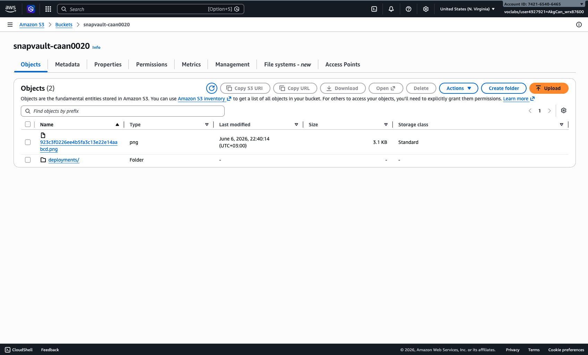
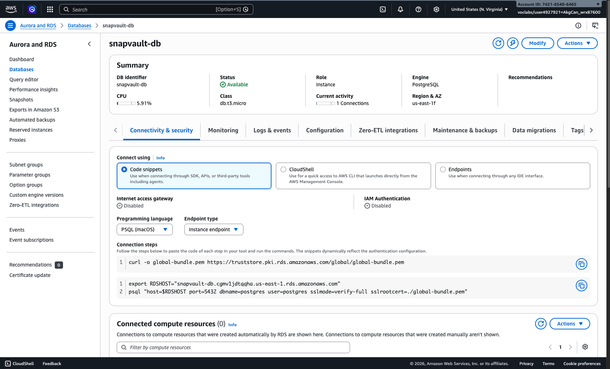
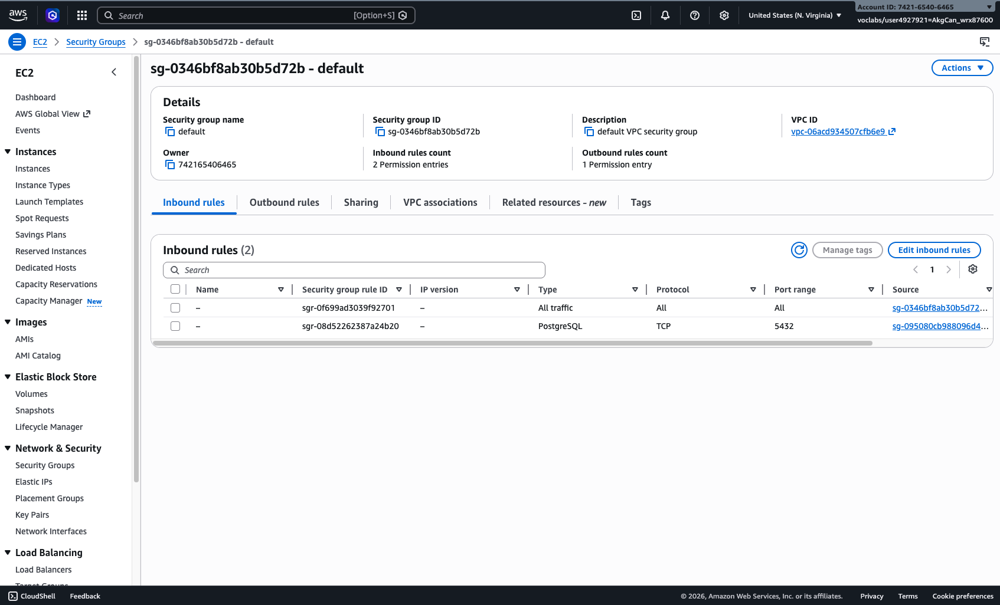
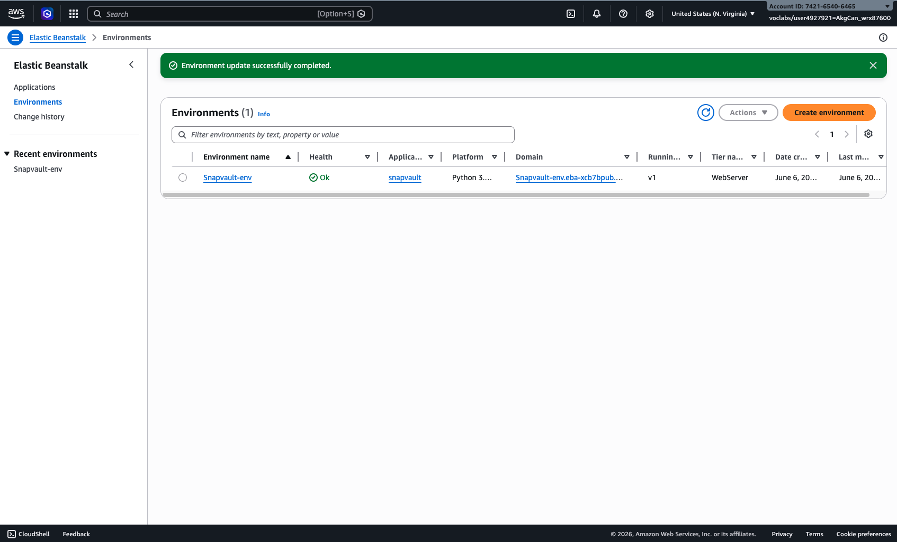
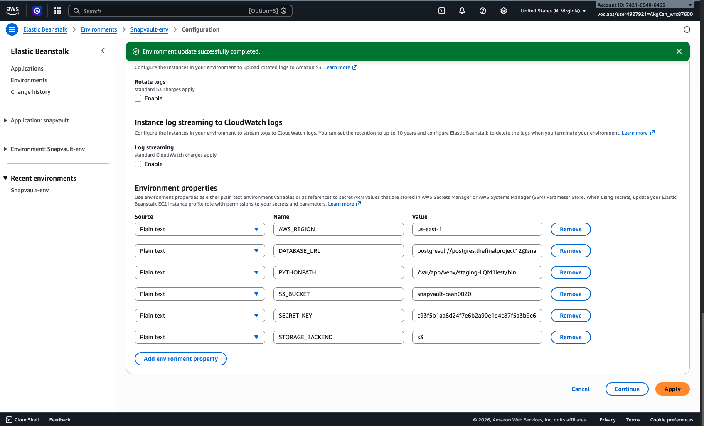
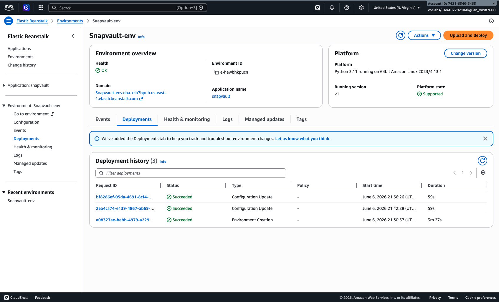
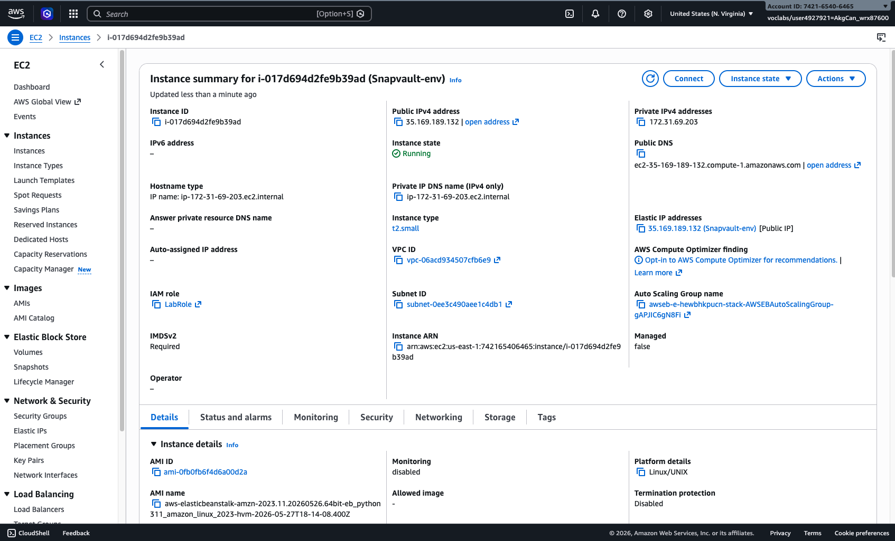
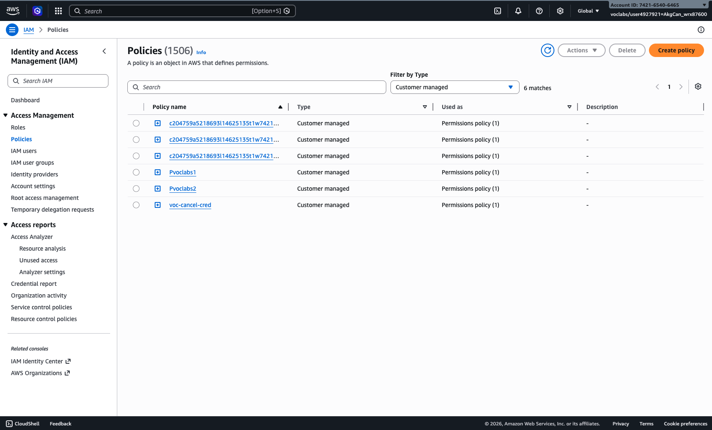
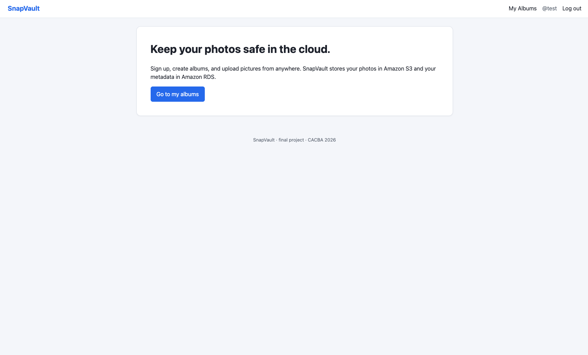
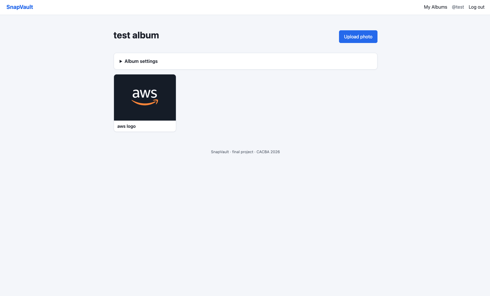

# SnapVault — Final Project Report

A small photo-gallery web application written in Python with Flask,
deployed to AWS using Elastic Beanstalk, RDS PostgreSQL, and S3.

**Author:** Can Akgun (`caan0020`)
**Course:** CACBA 2026 — Final Project
**Live URL:** http://snapvault-env.eba-xcb7bpub.us-east-1.elasticbeanstalk.com

---

## Table of contents

1. [Project description](#project-description)
2. [Architecture](#architecture)
3. [AWS services used](#aws-services-used)
4. [Deployment to the cloud](#deployment-to-the-cloud)
5. [Problems encountered and how they were solved](#problems-encountered-and-how-they-were-solved)
6. [Repository content](#repository-content)
7. [Running locally](#running-locally)

---

## Project description

SnapVault is a web-based photo gallery. After signing up, each user can
create albums, upload pictures, browse a responsive thumbnail grid,
edit metadata, and delete what they no longer want. The goal is to give
a single, simple place to keep memories safe in AWS rather than on a
phone or laptop that can break.

### What the app actually does (full CRUD)

The rubric asks for a CRUD application; here is the explicit mapping:

| Entity | Create | Read | Update | Delete |
|---|---|---|---|---|
| **User** | Register | Login session | (not exposed) | (not exposed) |
| **Album** | "Create album" form | "My albums" list + album page | Rename album | Delete album (cascades to its photos and S3 objects) |
| **Photo** | "Upload photo" form (writes to S3 + RDS) | Album gallery + single-photo view (presigned S3 URL) | Edit title and description | Delete (removes RDS row + S3 object) |

### Pages (server-rendered)

1. Home / landing page (`/`)
2. Register (`/register`)
3. Log in (`/login`)
4. My albums (`/albums`)
5. Single album (`/albums/<id>`)
6. Upload photo (`/albums/<id>/upload`)
7. Single photo (`/photos/<id>`)

That is well above the "at least three pages" requirement.

---

## Architecture

```
                       Public internet
                              │
                              │ HTTPS / HTTP
                              ▼
                ┌────────────────────────────┐
                │   AWS Elastic Beanstalk    │
                │   (single-instance env)    │
                │                            │
                │   EC2  t2.micro            │
                │     Nginx → Gunicorn       │
                │       Flask app            │
                │       (psycopg2, boto3)    │
                │                            │
                │   IAM role: LabRole        │
                └────────────┬───────────────┘
                             │
            ┌────────────────┼──────────────────┐
            │                │                  │
            ▼ port 5432      ▼ HTTPS S3 API     ▼ presigned URL
    ┌────────────────┐   ┌──────────────┐   browser fetches photo
    │  Amazon RDS    │   │  Amazon S3   │
    │  PostgreSQL    │   │  bucket:     │
    │  db.t3.micro   │   │  snapvault-  │
    │  Single-AZ     │   │   caan0020   │
    │  Private       │   │  private     │
    └────────────────┘   └──────────────┘
```

### Framework choices

- **Python with Flask** for the web layer. Flask is small, well-documented,
  and the Elastic Beanstalk Python platform looks for a WSGI callable named
  `application` — which is exactly what `application/application.py` exposes.
- **Flask-SQLAlchemy** as the ORM. The data model is small but very
  relational (users own albums, albums own photos), and SQLAlchemy makes
  the cascading delete from album → photos → S3 keys a single statement.
- **Flask-Login** for sessions. Each user only sees their own albums; the
  route handlers check ownership before responding.
- **Jinja2** for server-rendered templates. No JavaScript build step;
  every page is one round trip.
- **boto3** for AWS calls. Used directly in `snapvault/storage.py` (not
  hidden behind another wrapper) so the upload/download/delete flow is
  obvious — important for the rubric's "files should be uploaded directly
  by the app code" criterion.
- **psycopg2-binary** as the Postgres driver. Standard for Flask +
  SQLAlchemy + RDS.

### How configuration crosses the local/cloud boundary

The app reads `DATABASE_URL`, `STORAGE_BACKEND`, `S3_BUCKET`, `AWS_REGION`,
and `SECRET_KEY` from environment variables. With no env vars set, it
falls back to SQLite + a local `uploads/` directory, which is what
`python application.py` uses for local development. On Elastic Beanstalk
the env vars point at RDS + S3, and the same code switches with zero
changes. This is the 12-factor "config in the environment" principle —
the storage backend in `snapvault/storage.py` exposes the same three
operations (`save`, `get_url`, `delete`) for both `LocalStorage` and
`S3Storage`, so the route handlers never care which one is active.

---

## AWS services used

### Amazon S3 — photo storage

The image files themselves live in a single private S3 bucket called
`snapvault-caan0020` in `us-east-1`. When the app needs to display a
photo it calls `s3.generate_presigned_url` to get a one-hour signed URL
and hands that to the browser; the bucket itself never serves public
objects. Upload, download, and delete are implemented as three named
boto3 calls in `snapvault/storage.py` (`put_object`,
`generate_presigned_url`, `delete_object`).



Full setup steps and the `s3:*` permission discussion are in
[`infrastructure/setup-s3.md`](infrastructure/setup-s3.md).

### Amazon RDS — relational metadata

A single PostgreSQL instance (`db.t3.micro`, Single-AZ, gp2 storage)
holds the `users`, `albums`, and `photos` tables. We chose Postgres
because the data model is naturally relational and because the Flask
codebase already imports `psycopg2-binary`. RDS is private — it has no
public IP, and the only thing that can reach it is the Elastic Beanstalk
EC2 instance, through a security group rule that references the EB
security group by ID rather than a hardcoded IP range.




Full setup walkthrough and the `gp3 → gp2` lesson are in
[`infrastructure/setup-rds.md`](infrastructure/setup-rds.md).

### AWS Elastic Beanstalk — application hosting

The Flask app runs on a single-instance Elastic Beanstalk environment
(`Snapvault-env`) on the Python 3.11 / Amazon Linux 2023 platform.
Beanstalk gave us Nginx, Gunicorn, the EC2 instance, the security group,
the CloudWatch alarms, and the public CNAME — all without writing any
infrastructure code. Deployments are zip uploads from S3 (see the
deployment section below). The single-instance preset skips the
Application Load Balancer, which is the most expensive part of a default
Beanstalk environment — fine for a project with one demo user.





Full deployment walkthrough is in
[`infrastructure/setup-eb.md`](infrastructure/setup-eb.md).

### Amazon EC2 — the actual instance

Behind Beanstalk is a single `t2.micro` EC2 instance running Amazon
Linux 2023. We never SSH into it; Beanstalk manages it. It has the
`LabInstanceProfile` attached, which grants it the AWS API permissions
the app needs at runtime (S3 read/write, CloudWatch log push). Because
the instance profile gives the application AWS credentials automatically,
the repository contains zero AWS access keys.



### AWS IAM — credentials and access

The AWS Academy Learner Lab forbids creating new IAM roles or users, so
we deliberately reused the lab's pre-existing `LabRole` and
`LabInstanceProfile`. `LabRole` already grants the permissions the app
needs (S3 read/write, RDS access from within the VPC), which was
confirmed by an S3 upload-download-delete smoke test before any Flask
code touched the cloud. This is actually a security improvement over
the textbook approach: no static `AWS_ACCESS_KEY_ID` / `AWS_SECRET_ACCESS_KEY`
appear in the code, the environment, or the repository at any point.



---

## Deployment to the cloud

The full deploy procedure is documented in
[`infrastructure/setup-eb.md`](infrastructure/setup-eb.md). At a glance:

1. **Package the application code as a zip** in the Cloud9 terminal:
   ```bash
   cd ~/sdpcba-2026-finalproject-caan0020/application
   zip -r ../snapvault-v1.zip . -x "*.venv*" "*__pycache__*" "*.db" "uploads/*"
   ```
2. **Upload the zip to S3**, since the AWS Academy Learner Lab terminal
   has no GUI file picker:
   ```bash
   aws s3 cp ~/sdpcba-2026-finalproject-caan0020/snapvault-v1.zip \
     s3://snapvault-caan0020/deployments/snapvault-v1.zip
   ```
3. **Create an Elastic Beanstalk application** named `snapvault` from
   the AWS Console, picking the Python 3.11 platform, the S3 URL from
   step 2 as the application source, and the **Single instance** preset.
4. **Service access page (the critical IAM step):** set the **service
   role** to `LabRole` and the **EC2 instance profile** to
   `LabInstanceProfile`. The wizard's default is to create new roles,
   which the Learner Lab denies — picking the existing lab roles is
   what makes the create succeed.
5. **Networking:** default VPC, public IP activated, all instance
   subnets selected. No load balancer (single instance).
6. **Instance type:** `t2.micro` (the `t3.micro` we used for RDS isn't
   in the EB instance class dropdown).
7. **Once the environment is `Health: OK`**, set the five environment
   properties (`STORAGE_BACKEND`, `S3_BUCKET`, `AWS_REGION`,
   `DATABASE_URL`, `SECRET_KEY`) under **Configuration → Updates,
   monitoring, and logging → Edit**. This triggers an automatic
   redeploy.
8. **Open the RDS firewall to the EB instance.** In EC2 → Security
   Groups, edit the inbound rules of the security group attached to
   the RDS instance and allow PostgreSQL (port 5432) from the EB
   security group ID. Without this rule the app starts up, tries to
   connect to RDS, and crashes.

After step 8, the live URL serves the running app. The first end-to-end
test (register → create album → upload photo → see it in the gallery)
simultaneously proved that Beanstalk, RDS, and S3 were correctly wired
together.




---

## Problems encountered and how they were solved

This is the most useful part of the report — six concrete things that
broke on the way and how they were diagnosed. Each one took real time;
documenting them prevents the next student from losing the same hours.

### 1. RDS `Pvoclabs2` explicit-deny on storage type gp3

Clicking *Create database* in the RDS wizard returned:

> *User ... is not authorized to perform: rds:CreateDBInstance ... with an
> explicit deny in an identity-based policy: arn:aws:iam::.../Pvoclabs2*

The error did not name the offending attribute, which made it hard to
debug because the wizard has dozens of fields. The diagnostic process
was to toggle one field at a time and resubmit. After ruling out the
instance class, engine version, encryption, and Multi-AZ, the culprit
turned out to be the **storage type**: the wizard's default — even
under the Sandbox template — is **gp3**, and Pvoclabs2 only allows
**gp2** in this lab variant. Switching the storage type to gp2 made
the next submission succeed immediately. Recorded in
[`infrastructure/setup-rds.md`](infrastructure/setup-rds.md).

### 2. AWS Academy terminal Python 3.7 cannot install `awsebcli`

The standard tool for Beanstalk deployments is the `awsebcli` CLI. But
the AWS Academy Learner Lab terminal runs Python 3.7, which is past its
end-of-life date. Installing `awsebcli` failed with a `setuptools` /
`typing.Protocol` import error: modern Python packaging tools no longer
support 3.7. Pinning `awsebcli==3.20.10` would have worked, but at that
point switching to a console-based deploy was faster — and gave free
screenshots for the report. So the deploy is documented as a console
workflow in [`setup-eb.md`](infrastructure/setup-eb.md). Worth noting
that this isn't a problem on real Cloud9, only the in-browser AWS
Academy terminal.

### 3. Elastic Beanstalk `eb create` requires `LabInstanceProfile`

The first create attempt in the console used the wizard's default
"create a new role for me" service-role and instance-profile choices,
and failed several minutes in with an IAM denial. The fix was to pick
**`LabRole`** as the service role and **`LabInstanceProfile`** as the
EC2 instance profile — both are pre-created by the lab. Learner Lab
explicitly denies `iam:CreateRole` and `iam:CreateInstanceProfile`, so
any flow that tries to make new ones fails.

### 4. Application crashed on first deploy because Initial DB name was blank

After Beanstalk was running and env vars were set, the health turned
**Degraded**. The logs (`web.stdout.log`) showed:

> *psycopg2.OperationalError: connection to server at "...rds.amazonaws.com",
> port 5432 failed: FATAL: database "snapvault" does not exist*

This was actually good news — the connection itself succeeded, password
auth passed, the security-group rule worked. The problem was the
"Initial database name" field had been left blank in the RDS wizard, so
the only database on the instance was the default `postgres`. Two fixes:
either connect with `psql` and run `CREATE DATABASE snapvault;`, or
change the `DATABASE_URL` env var to point at the existing `postgres`
database. We picked the env-var change because it avoided needing
network access to RDS from outside Beanstalk. After the env-var update
the app booted cleanly.

### 5. Wrong git author on the first commits

Early commits were authored by the freelance assistant's identity
because the local repo had no `user.name` / `user.email` set and git
fell back to a global config. Visible on GitHub as the wrong avatar.
Fixed with `git commit --amend --reset-author --no-edit` after setting
the local identity to `caan0020`, then
`git push --force-with-lease origin main` to overwrite the bad commit.
The remote history now shows only `caan0020` as the author. Documented
in the Notion engineering notes alongside notes on what `--amend
--reset-author` and `--force-with-lease` actually do.

### 6. Aurora vs RDS PostgreSQL confusion in the wizard

The unified "Aurora and RDS" console makes Aurora and standard RDS
PostgreSQL look very similar, and Aurora is explicitly denied by
Pvoclabs2. The Templates row gave it away — Aurora shows "Sandbox" as
the third template, standard PostgreSQL shows "Free tier" (or, for
non-Free-Tier-eligible accounts like the Learner Lab, also "Sandbox").
The fix was to click the **PostgreSQL** card under *Amazon RDS*, not
the very-similarly-named *Aurora (PostgreSQL Compatible)* card.

---

## Repository content

```
sdpcba-2026-finalproject-caan0020/
├── README.md                       # This report
├── application/                    # The Flask app (Elastic Beanstalk deployment root)
│   ├── application.py              # WSGI entry — exposes `application`
│   ├── config.py                   # env-driven config (DB URL, S3 bucket, ...)
│   ├── requirements.txt            # Python dependencies
│   ├── README.md                   # Short app description and how to run
│   └── snapvault/
│       ├── __init__.py             # Flask app factory
│       ├── models.py               # SQLAlchemy models: User, Album, Photo
│       ├── storage.py              # boto3-backed S3Storage + LocalStorage
│       ├── auth.py                 # /register, /login, /logout
│       ├── main.py                 # CRUD routes for albums and photos
│       ├── templates/              # 8 Jinja templates
│       └── static/style.css
└── infrastructure/
    ├── README.md                   # Index of infrastructure artifacts
    ├── setup-s3.md                 # S3 bucket creation walkthrough
    ├── setup-rds.md                # RDS instance creation walkthrough
    ├── setup-eb.md                 # Elastic Beanstalk deployment walkthrough
    └── screenshots/                # 10 AWS console screenshots referenced above
```

---

## Running locally

For developer iteration, the same code runs on SQLite + a local
`uploads/` directory:

```bash
cd application
python3 -m venv .venv && source .venv/bin/activate
pip install -r requirements.txt
python application.py
# open http://127.0.0.1:5050
```

Setting `STORAGE_BACKEND=s3`, `S3_BUCKET=...`, and
`DATABASE_URL=postgresql://...` flips it onto RDS + S3 with zero code
changes — the same trick Elastic Beanstalk uses at deploy time.
